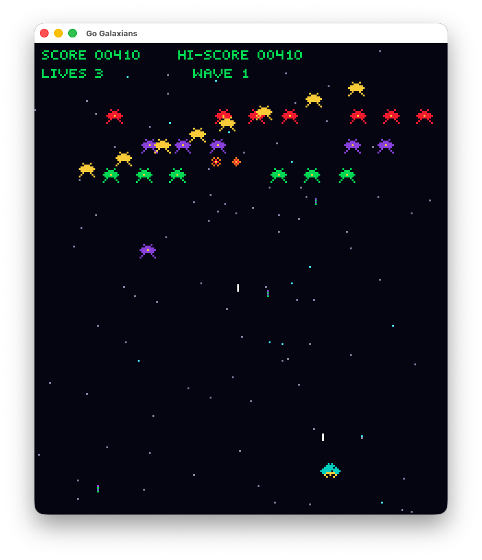

# Go Galaxians

A classic arcade-inspired Galaxians-style game written in Go using [Ebitengine](https://ebitengine.org/).

This project started with fully code-generated pixel sprites (no external image assets) and now includes a playable gameplay loop.



## Implementation details
Project was just to test out the speed of the new GPT‑5.3‑Codex‑Spark.  The full first iteration from [plan](PLAN.md) 
to  playable game in 8 steps tok less than 10 minutes in total with agent committing after each step.

## Features

- Code-generated sprites for:
  - Player ship and explosions
  - Multiple enemy types
  - Bullets and effects
  - Pixel glyphs for UI text
- Vertical arcade logical resolution (`224x256`)
- Playable loop with:
  - Title screen
  - Player movement and shooting
  - Enemy formation movement
  - Enemy dive attacks
  - Enemy firing
  - Collision detection and explosions
  - Score and high-score HUD
  - Lives, wave progression, game over, restart
- Animated starfield background
- Wave entry timing for enemy formations
- Per-enemy scoring and extra-life thresholds
- Automated tests for sprite generation and core gameplay behaviors

## Controls

- `Left Arrow`: Move left
- `Right Arrow`: Move right
- `Space`: Start game / Shoot / Restart after game over

## Requirements

- Go 1.22+ (or compatible modern Go toolchain)
- macOS, Linux, or Windows with graphics support compatible with Ebitengine

## Run

```bash
go run .
```

## Test

```bash
go test ./...
```

## Build

```bash
go build ./...
```

## Project Structure

- `main.go` - App entrypoint and window setup
- `internal/game/` - Gameplay state, entities, update loop, rendering, combat, enemies, starfield
- `internal/spritegen/` - Code-based sprite generation and tests
- `internal/render/` - Sprite registry/types
- `internal/scene/` - Shared text rendering helpers using generated glyph sprites

## Notes

- Sprites are generated once at startup and reused.
- No external image files are required.
- On macOS you may see Metal deprecation warnings from Ebitengine internals during build/test; these are warnings, not failures.

## Roadmap Ideas

- Authentic enemy flight patterns and escort logic
- Attract mode and demo loop
- Sound effects and music
- More accurate arcade scoring/timing
- Persistent high-score storage
